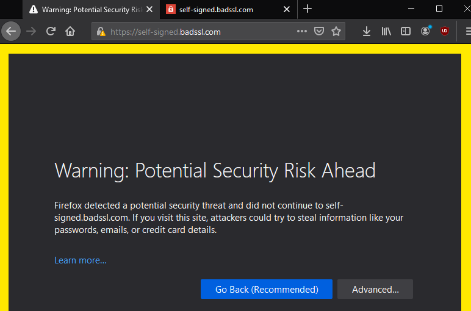
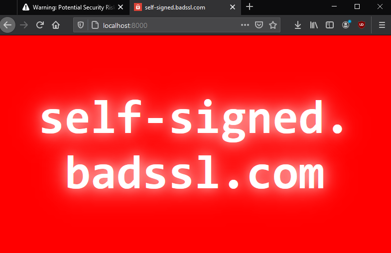

# Simple HTTP proxy server with an HTTPS target in a Docker Container

### What ?

It's a sample implementation of https://github.com/http-party/node-http-proxy

### Running
```
docker-compose up
curl http://localhost:8000 

## to see contents of https://self-signed.badssl.com

```

### Use Case

I've found an issue with a third party app. The app was failing on accessing a
site with a custom certificate. 
for the purpose of this readme it's going to be a self-signed.badssl.com which is
the good example as it has self-signed certificate.

Anyways, this was supposed to be a hack to play with proxying and docker and trying
to fix the problem as a side effect. It can be fixed by installing the certificate 
somewhere else, I know. It's just a POC

## How it works

1. create docker image with a proxy server to https://self-signed.badssl.com that will
   suppress the certificate issue 
2. use http://localhost:8000 to access that site without certificate errors 

so instead of seeing 



you'll see 




